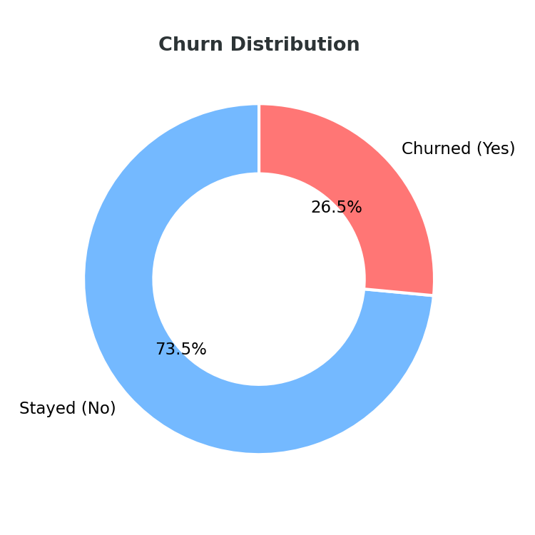
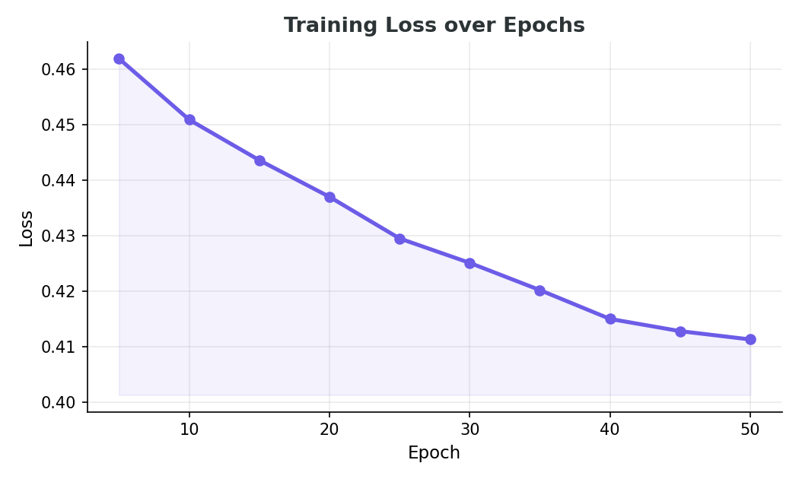

# 📉 Customer Churn Predictor

A churn prediction project built with PyTorch, plus a small Streamlit app to test the model live.

---

## What this project does

Telecom companies lose a portion of their customers every month, and the earlier you can spot who's likely to leave, the more you can actually do about it. This project trains a neural network on a real telecom dataset of 7,043 customers to predict which ones are at risk of churning.

One thing that stood out early on: only 27% of customers in the data had actually churned. That kind of imbalance matters, because a model that just predicts "everyone stays" would look accurate on paper while being completely useless in practice.

<p align="center">
  
</p>

---

## Approach

I started with a Logistic Regression model as a baseline, then moved on to the main part of the project: a neural network built with PyTorch. Three versions were trained and compared to see how architecture and training length actually affect performance.

- **Version 1** — a simple two-layer network (32→16), trained on SMOTE-balanced data
- **Version 2** — a bigger network (64→32→16) trained for twice as many epochs, expecting better results. It didn't work out that way — the extra capacity mostly led to overfitting on the synthetic SMOTE data.
- **Version 3** — back to the simple architecture, but this time using `pos_weight` in the loss function instead of SMOTE. This is the version that actually improved on the baseline.

<p align="center">
  
</p>

---

## Results

<p align="center">
  
</p>

| Model | ROC-AUC | Recall (Churn) | F1 (Churn) |
|---|---|---|---|
| Logistic Regression + SMOTE | 0.833 | 0.78 | 0.61 |
| Neural Net v1 (SMOTE) | 0.816 | 0.71 | 0.59 |
| Neural Net v2 (deeper, SMOTE) | 0.773 | 0.64 | 0.55 |
| **Neural Net v3 (pos_weight)** | **0.831** | **0.80** | 0.61 |

Version 3 came out on top — not because it was more complex, but because it handled class imbalance in a way that suited this data better. It's also the model used in the web app.

---

## Tech stack

`Python` · `PyTorch` · `scikit-learn` · `imbalanced-learn (SMOTE)` · `Plotly` · `Streamlit`

---

## Running it

```bash
pip install -r requirements.txt
```

To go through the full analysis and model training:
```bash
jupyter notebook churn_classification.ipynb
```

To try the model interactively:
```bash
streamlit run app.py
```

This opens a form where you can enter a hypothetical customer's details and see the model's churn prediction.

---

## Project structure

```
├── churn.ipynb              # full analysis, training, and evaluation
├── app.py                   # Streamlit web app
├── model_def.py              # neural network architecture
├── requirements.txt
├── data/
│   └── IT_customer_churn.csv
├── models/
│   ├── churn_model.pth
│   ├── preprocessor.pkl
│   └── input_dim.pkl
├── charts/
│   ├── loss_curve.png
│   ├── model_comparison.png
│   └── churn_distribution.png
└── README.md
```
